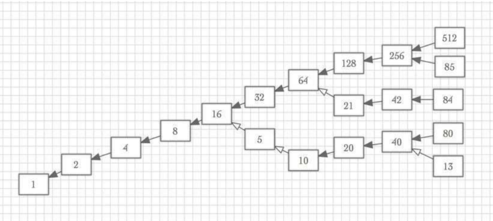

# 3N + 1 문제

## 문제

자연수 `N`에 대해 다음 연산을 반복한다.

- `N`이 짝수이면 → `N / 2`
- `N`이 홀수이면 → `3N + 1`

이 과정을 반복하면 어떤 수든 결국 `1`이 된다고 알려져 있다.

예를 들어:

```text
5 → 16 → 8 → 4 → 2 → 1
13 → 40 → 20 → 10 → 5 → 16 → 8 → 4 → 2 → 1
21 → 64 → 32 → 16 → 8 → 4 → 2 → 1
```

아래 그림은 여러 수들이 `1`로 수렴하는 과정을 나타낸 예시이다.



정확하게 `K`번 (`K ≤ 63`) 연산을 반복하였을 때 `1`이 되는 수들 중:

- 가장 작은 수
- 가장 큰 수

를 구하는 프로그램을 작성하시오.

---

## 입력

첫째 줄에 정수 `K`가 주어진다.

```text
0 ≤ K ≤ 63
```

---

## 출력

정확히 `K`번의 연산 후 `1`이 되는 수들 중:

- 가장 작은 수
- 가장 큰 수

를 공백으로 구분하여 출력한다.