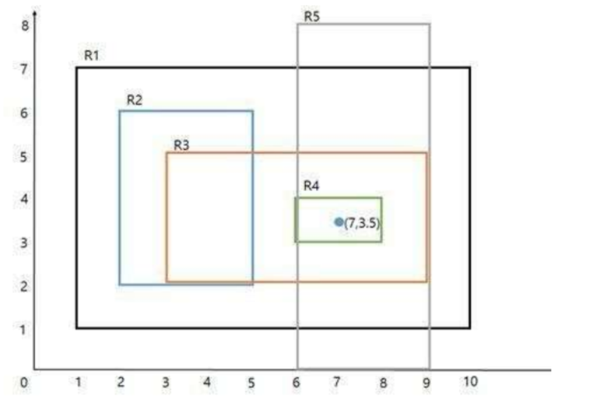

# 직사각형 (SCPC 2016)

## 문제

평면 위에 `N`개의 직사각형이 주어진다.

각 직사각형은 축에 평행한 형태이며, 두 점:

- `(x1, y1)` : 왼쪽 아래 좌표
- `(x2, y2)` : 오른쪽 위 좌표

로 표현된다.

두 직사각형 `A`, `B`에 대해:

- `A`가 `B`를 완전히 포함하거나
- `B`가 `A`를 완전히 포함하는 경우

이 두 직사각형은 포함 관계에 있다고 한다.

직사각형들의 포함 관계를 이용하여,  
서로 포함 관계로 연결될 수 있는 직사각형들의 최대 개수를 구하는 프로그램을 작성하시오.

---

## 그림 예시



위 그림에서는 여러 직사각형들이 서로 포함 관계를 이루고 있다.

---

## 입력

첫째 줄에 직사각형의 개수 `N`이 주어진다.

```text
1 ≤ N ≤ ...
```

다음 `N`개의 줄에는 각 직사각형의 정보가 주어진다.

```text
x1 y1 x2 y2
```

- `(x1, y1)` : 왼쪽 아래 좌표
- `(x2, y2)` : 오른쪽 위 좌표
- 항상 `x1 < x2`, `y1 < y2`

---

## 출력

포함 관계를 이루는 직사각형들의 최대 개수를 출력한다.